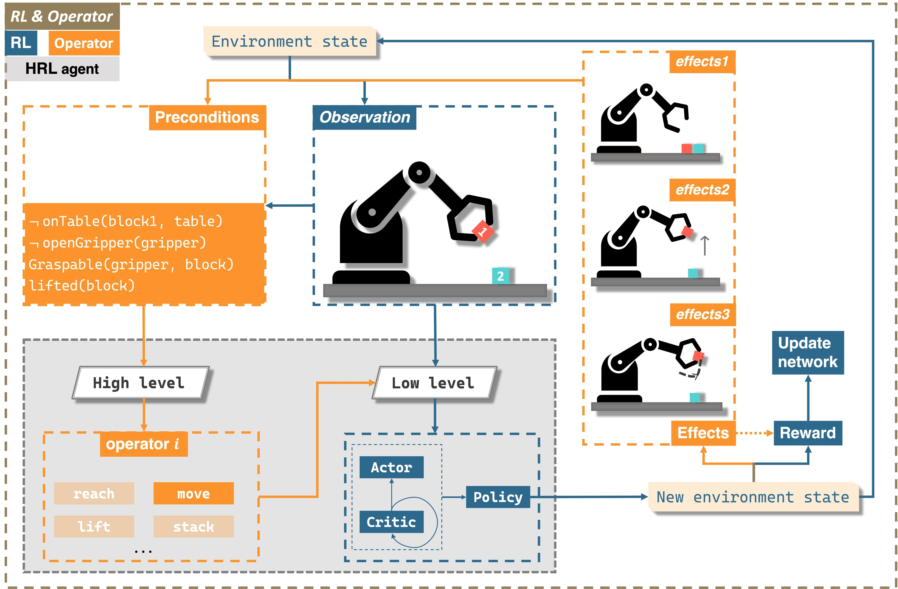

# Hierarchical Reinforcement Learning based on Planning Operators
## Introduction
**Paper website:** https://arxiv.org/pdf/2309.14237.pdf
**Author:** Jing Zhang, Karinne Ramirez-Amaro
## Framework


## Setup
```commandline
git@github.com:Bleuoutremer/RL_operator.git
```
```commandline
pip install -r requirements.txt
```
## Training
```commandline
cd scripts/experiments
bash main.bash 42 cuda:0 stack_2
```

## Independent Policy Evaluation
### without render
```commandline
cd scripts/evaluation
bash visualize_model.bash 37 "trained_model/" "state_dict.pt" "sacx_experiment_setting.pkl" 50 5 false
```
### render
```commandline
bash visualize_model.bash 37 "trained_model/" "state_dict.pt" "sacx_experiment_setting.pkl" 50 5 true
```
for other policies, change the last number "5", (open:0, close:1, reach:2, lift:3, move:4, stack:5)

## Note
1. Current hyperparameters only apply for 2 blocks, more blocks need fine-tuning.
2. As for planning success rate, it was evaluated through training process, check "/home/omen/Downloads/RL_operator/trained_model/tensorboard":
```commandline
cd trained_model
tensorboard --logdir=tensorboard
```
then it is shown in "evaluation_info/epoch_success_rate".
